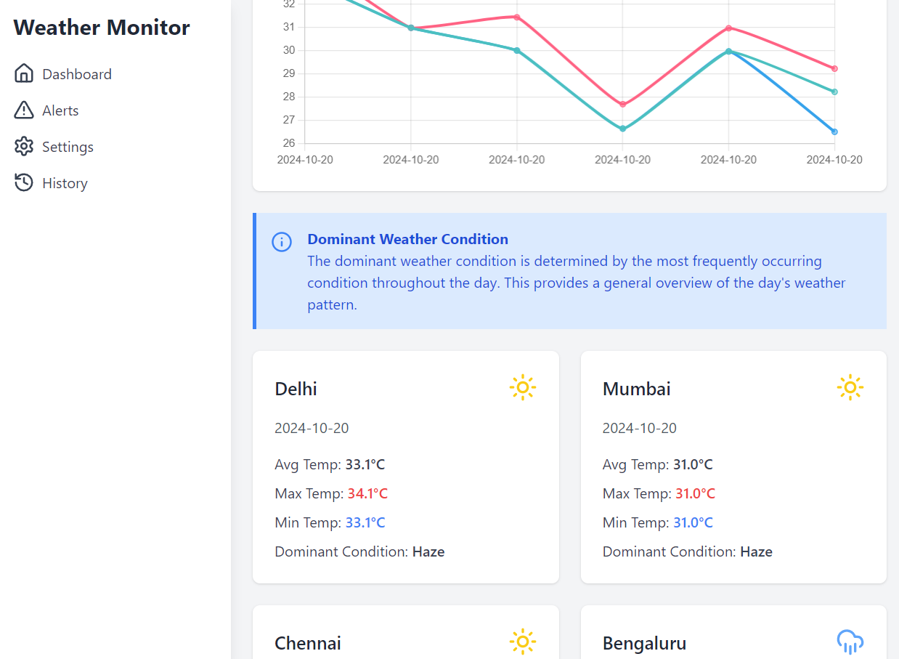
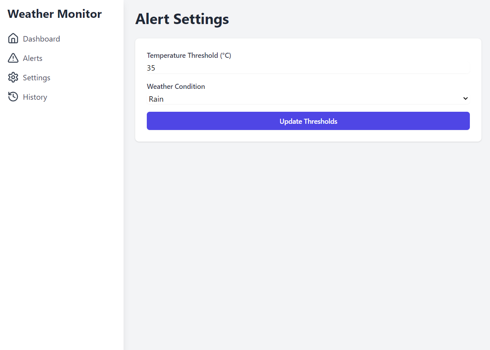
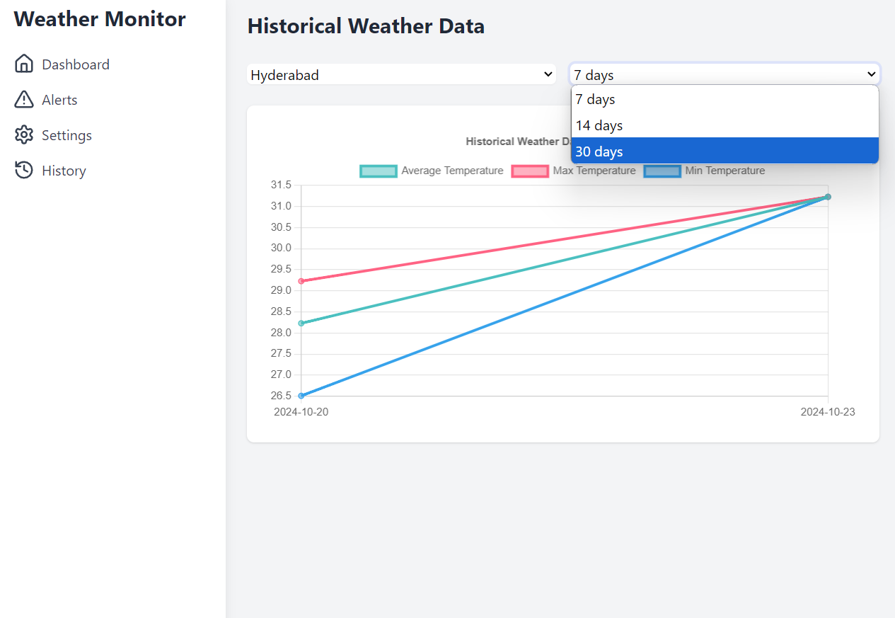
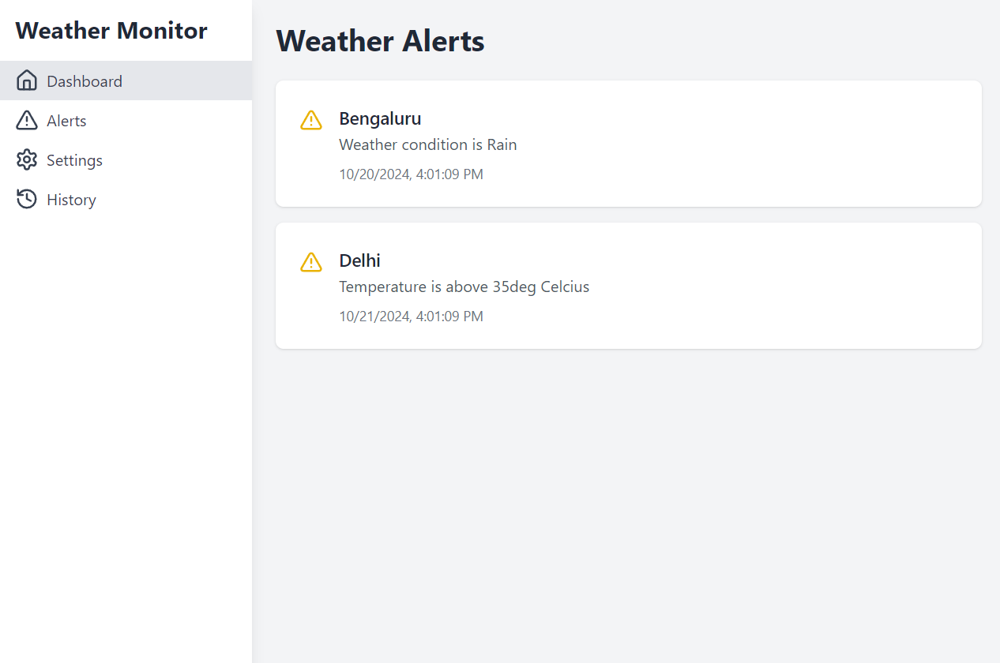

# My Cool Weather Monitoring App
**Key Features:**
- **User Customisable Weather Alerts**
- **Graphical Weather Visualization**
- **Historical Weather Data Analysis**

## What's This All About?

Hey there! 👋 I've built this neat little app that keeps an eye on the weather in real-time for a bunch of cities in India. It grabs data from OpenWeatherMap, crunches some numbers, and shows you what's going on with the weather right now and over time.

## Check It Out

<div style="display: inline-block;">
   
   
   
   
</div>

## Cool Stuff It Does

- Shows you the weather right now in major Indian cities
- Gives you a daily weather recap
- Lets you know when the weather's acting up (like it's super hot or raining cats and dogs)
- Shows you how the weather's been behaving over time
- Looks pretty sweet on your phone or computer

## What I Used to Build It

- For the behind-the-scenes stuff: Node.js and Express.js
- For the stuff you see: React.js and Tailwind CSS
- To store all the weather info: MongoDB
- To get the weather data: OpenWeatherMap's API

## Before You Start

Make sure you've got these installed:

- Node.js (version 14 or newer)
- npm (version 6 or newer)
- MongoDB (version 4 or newer)
- Docker (if you want to use it, but no pressure!)

## Setting It Up

1. Grab the code:
   ```
   git clone https://github.com/yourusername/weather-monitoring.git
   cd weather-monitoring
   ```

2. Install the backend stuff:
   ```
   cd backend
   npm install
   ```

3. Install the frontend stuff:
   ```
   cd ../frontend
   npm install
   ```

4. Set up some secret stuff:
   Make a file called `.env` in the backend folder and put this in it:
   ```
   MONGODB_URI=mongodb://localhost:27017/weather_monitoring
   OPENWEATHERMAP_API_KEY=your_api_key_here
   PORT=5000
   ```
   (Don't forget to use your real OpenWeatherMap API key!)

## Firing It Up

1. Start the backend:
   ```
   cd backend
   npm start
   ```

2. Start the frontend:
   ```
   cd frontend
   npm start
   ```

3. Open up your browser and go to `http://localhost:3000`. Ta-da! 🎉

## Docker Stuff (If You're Into That)

If you want to use Docker:

1. Build the Docker images:
   ```
   docker-compose build
   ```

2. Start everything up:
   ```
   docker-compose up
   ```

Then just head to `http://localhost:3000` in your browser.

## Why I Built It This Way

I went with the MERN stack (MongoDB, Express.js, React, Node.js) because it's flexible and has tons of support. I made the app grab weather data every 5 minutes (you can change this if you want) to keep things up-to-date without bugging the OpenWeatherMap API too much.

I also added some cool features like daily weather summaries and an alert system to let you know when the weather's doing something crazy. The frontend looks pretty slick (if I do say so myself) and works great on phones and computers.

## What I Used to Build It

### Backend Stuff

- express: For making the web app
- mongoose: For working with MongoDB
- axios: For making HTTP requests
- cors: For handling cross-origin requests
- dotenv: For managing environment variables

### Frontend Stuff

- react: For building the user interface
- react-router-dom: For handling routing
- axios: For making HTTP requests
- chart.js and react-chartjs-2: For making those fancy charts
- tailwindcss: For making everything look good
- @tailwindcss/forms: For styling forms
- lucide-react: For those cute icons

## What's Next?

I've got some ideas for making this even cooler:

- Add user accounts
- Include more cities and countries
- Use fancier weather prediction models
- Add push notifications for alerts
- Track more weather stuff (like humidity and wind speed)

That's it! Hope you have fun with my weather app. If you have any questions or ideas, just give me a shout! 😄
